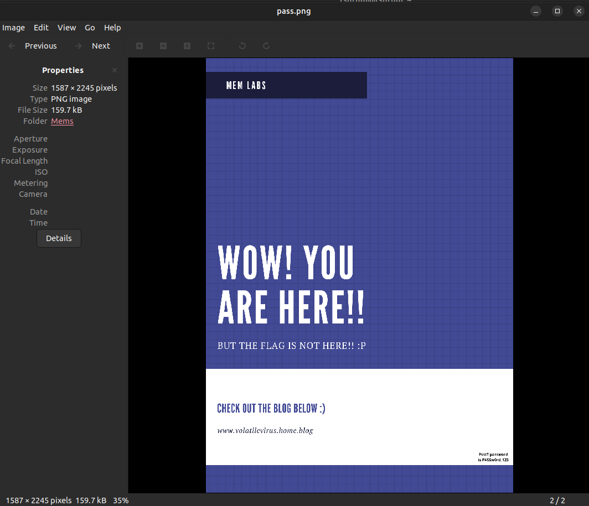
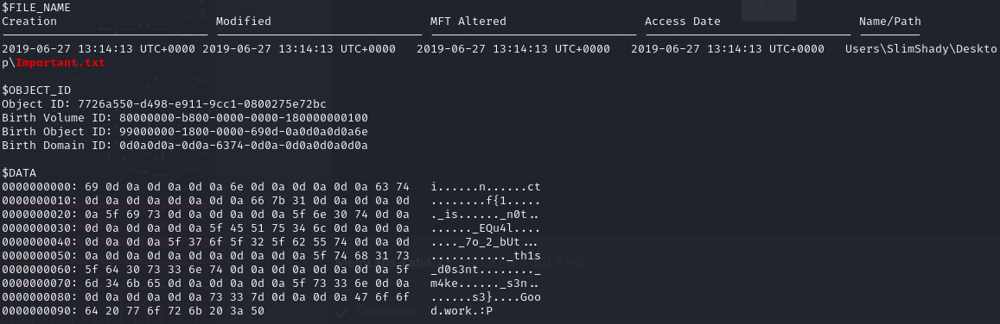
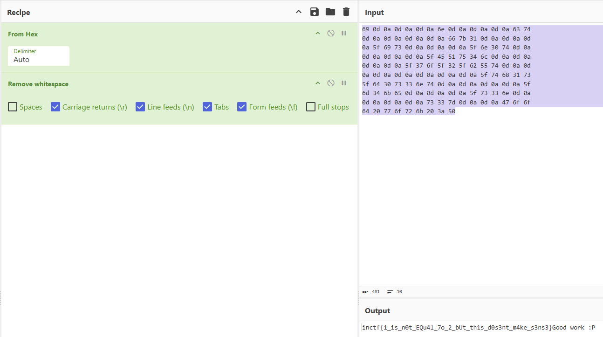
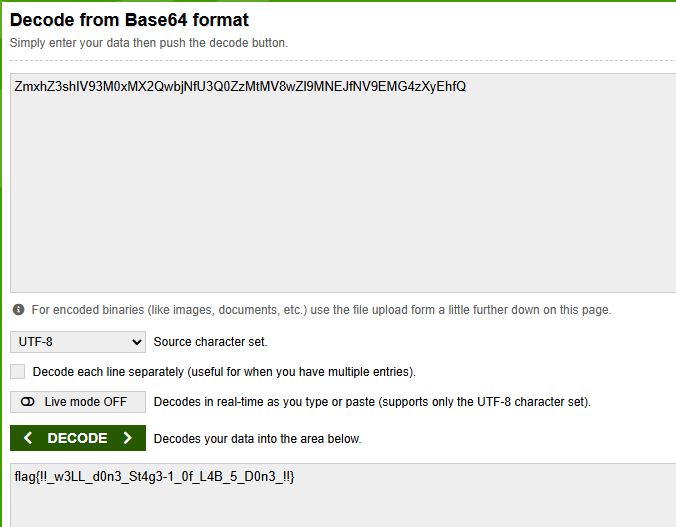
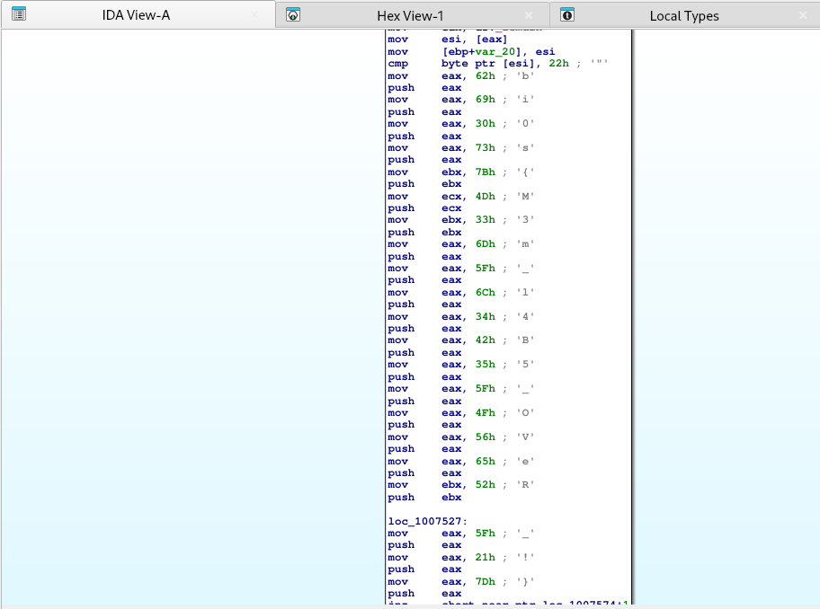

# MemLabs Solutions

This is solutions of famous memory forensics challenge [MemLabs](https://github.com/stuxnet999/MemLabs).

## MemLabs Lab 0

#### Use the following commands to acquire flag

```bash
volatility2 -f Challenge.raw imageinfo
volatility2 -f Challenge.raw --profile Win7SP1x86 pslist
volatility2 -f Challenge.raw --profile Win7SP1x86 cmdscan
volatility2 -f Challenge.raw --profile Win7SP1x86 consoles
volatility2 -f Challenge.raw --profile Win7SP1x86 envars
volatility2 -f Challenge.raw --profile Win7SP1x86 hashdump
```
Flag: flag{you_are_good_but1_4m_b3tt3r}

## MemLabs Lab 1

#### Use the following commands to acquire 1st flag

```bash
# Detect version of OS
volatility2 -f MemoryDump_Lab1.raw imageinfo
# List all running processes
volatility2 -f MemoryDump_Lab1.raw --profile Win7SP1x64 pslist
# List all executed CMDlets
volatility2 -f MemoryDump_Lab1.raw --profile Win7SP1x64 cmdscan
# List all stdout
volatility2 -f MemoryDump_Lab1.raw --profile Win7SP1x64 consoles
```
Flag encoded: ZmxhZ3t0aDFzXzFzX3RoM18xc3Rfc3Q0ZzMhIX0=

Flag: flag{th1s_1s_th3_1st_st4g3!!}

#### Use the following commands to acquire 2nd flag

```bash
# Find PID of mspaint
volatility2 -f MemoryDump_Lab1.raw --profile Win7SP1x64 pslist
# Dump run process to a file
volatility2 -f MemoryDump_Lab1.raw --profile Win7SP1x64 memdump -p 2424 -D paint/
# Change extension of file
mv 2424.raw 2424.data
# Open 2424.data file on GIMP
gimp 2424.data
```
###### Adjust width and height of image for reveal 2nd flag


#### Use the following commands to acquire 3rd flag

```bash
# List files that loaded to RAM. We only need Alissa's files
volatility2 -f MemoryDump_Lab1.raw --profile Win7SP1x64 filescan | grep "Alissa Simpson"
# Dump important.rar file
volatility2 -f MemoryDump_Lab1.raw --profile Win7SP1x64 dumpfiles -Q 0x000000003fac3bc0 -D important
# Find password of rar file by uppercase of hash of Alissa's password
volatility2 -f MemoryDump_Lab1.raw --profile Win7SP1x64 hashdump
# Unrar file
unar important.rar (Password required!)
```
###### flag3.png will be dropped


## MemLabs Lab 2

#### Use the following commands to acquire 1st flag

```bash
# Detect version of OS
volatility2 -f MemoryDump_Lab2.raw imageinfo
# List all process envars
volatility2 -f MemoryDump_Lab2.raw --profile Win7SP1x64 envars
```
Flag_encoded = ZmxhZ3t3M2xjMG0zX1QwXyRUNGczXyFfT2ZfTDRCXzJ9

Flag = flag{w3lc0m3_T0_$T4g3_!_Of_L4B_2})

#### Use the following commands to acquire 2nd flag

```bash
# Find location of hidden.kdbx and Password.png
volatility2 -f MemoryDump_Lab2.raw --profile Win7SP1x64 filescan
# Dump process to a file
volatility2 -f MemoryDump_Lab2.raw --profile Win7SP1x64 procdump -Q 0x000000003fb112a0 -D dumphidden/
# Dump Password.png to a file
volatility2 -f MemoryDump_Lab1.raw --profile Win7SP1x64 procdump -Q 0x000000003fce1c70 -D dumpPassword/
# Change extension of file
mv dumphidden/LONG_DUMP_FILE_NAME dumphidden/Hidden.kdbx
# Open Hidden.kdbx file on KeePassXC
sudo apt update
sudo apt install keepassxc
keepassxc
```
###### Extract Password from Password.png with zooming in right-down corner


###### Open kdbx file using password

###### Find flag location from saved passwords in DB


#### Use the following commands to acquire 3rd flag

```bash
# Dump Google Chrome history
volatility2 -f MemoryDump_Lab2.raw --profile Win7SP1x64 chromehistory
# There is a interesting link to mega.nz folder
https://mega.nz/folder/TrgSQQTS#H0ZrUzF0B-ZKNM3y9E76lg
```
###### Download and open file

###### Insert Password (Found it from hint in zip file that is SHA1 of flag3_Lab1(flag{w3ll_3rd_stage_was_easy}) = 6045dd90029719a039fd2d2ebcca718439dd100a)


## MemLabs Lab 3

#### Use the following commands to acquire 1st part of the flag
##### A malicious script encrypted a very secret piece of information. So, both of the encryptor and encrypted files must be loaded to the RAM.
```bash
# Detect version of OS
volatility2 -f MemoryDump_Lab3.raw imageinfo
# Profile detected. Time to run filescan for cached files
volatility2 -f MemoryDump_Lab3.raw --profile=Win7SP1x86 filescan
# After a few greps we can find cached evilscript.py. Dump it
volatility2 -f MemoryDump_Lab3.raw --profile=Win7SP1x86 dumpfiles -Q 0x000000003de1b5f0 -D 3memlabs
# Read the code
cat 3memlabs/file.None.0xbc2b6af0.dat
```

Here is the python code:
```python
import sys
import string

def xor(s):

        a = ''.join(chr(ord(i)^3) for i in s)
        return a


def encoder(x):

        return x.encode("base64")


if __name__ == "__main__":

        f = open("C:\\Users\\hello\\Desktop\\vip.txt", "w")

        arr = sys.argv[1]

        arr = encoder(xor(arr))

        f.write(arr)

        f.close()
```

It is encrypting file called "vip.txt". Dump it from cache
```bash
# Dmping vip.txt
volatility2 -f MemoryDump_Lab3.raw --profile=Win7SP1x86 dumpfiles -Q 0x000000003e727e50 -D 3memlabs
# Read file content
cat file.None.0x83e52420.dat
```
After reading python code we can eaisly decrypt the content of the vip.txt
```python
import base64

def reverse_xor(s):
    return ''.join(chr(ord(i) ^ 3) for i in s)

# Encoded string
encoded = "am1gd2V4M20wXGs3b2U="

# Step 1: Decode from Base64
decoded = base64.b64decode(encoded).decode()

# Step 2: Reverse the XOR operation
original = reverse_xor(decoded)
original
```
Flag = inctf{0n3_h4lf

#### Use the following commands to acquire 2nd part of the flag
##### You will need this steghide to solve the challenge. Steghide is a stenography tool, which used for hide some data in other form of the data mostly text in images. Search for image files and after a few greps we found suspision1.jpeg. Dump it
```bash
volatility2 -f MemoryDump_Lab3.raw --profile=Win7SP1x86 dumpfiles -Q 0x0000000004f34148 -D 3memlabs
```

Check image:

##### Hmm, there is some some noise along the diagonal of the image. But it is not a case with the real one, which I found online by image code under the dumped one.

##### Maybe, some data is hidden there :D. Let's check
```bash
steghide extract -sf 3memlabs/dumpfiles-suspision1.jpeg
```
##### It will ask for a passphrase. It is 1st flag, we found. Steghide will output file named "secret text". Let's check it
```bash
cat secret\ text

_1s_n0t_3n0ugh}
```
Flag = _1s_n0t_3n0ugh}

#### Complete flag of MemLabs Lab 3
#### Flag = flag1 + flag2 = inctf{0n3_h4lf_1s_n0t_3n0ugh}

## MemLabs Lab 4

#### Use the following commands to acquire the flag
##### The Hacker stole a lot of information but he also deleted a very important file of mine. Let's analyze cached files
```bash
# Detect version of OS
volatility2 -f MemoryDump_Lab4.raw imageinfo
# Profile detected. Time to run filescan for cached files
volatility2 -f MemoryDump_Lab4.raw --profile=Win7SP1x64 filescan
# After a few greps we can find cached Important.txt. Dump it
volatility2 -f MemoryDump_Lab4.raw --profile=Win7SP1x64 dumpfiles -Q 0x000000003fc398d0 -D 4memlabs
# Read the code
ls dump/
```

##### Strangely, dumpfiles can not dump anything. It is removed from cache. Let's check mft entry for further info. Maybe $DATA still holds the file if it is small enough :D
```bash
# Dump mft
volatility2 -f MemoryDump_Lab4.raw --profile=Win7SP1x64 mftparser > mft.txt
# Search for Important.txt
cat mft.txt | grep -A30 -B10 -i "important.txt"
```
Check output:

##### Let's decode it for our brains :D


#### Flag = inctf{1_is_n0t_EQu4l_7o_2_bUt_th1s_d0s3nt_m4ke_s3ns3}
#### Goodwork:P

## MemLabs Lab 5

#### Use the following commands to acquire the first flag
##### We received this memory dump from our client recently. Someone accessed his system when he was not there and he found some rather strange files being accessed. Find those files and they might be useful. I quote his exact statement:

```text
The names were not readable. They were composed of alphabets and numbers but I wasn't able to make out what exactly it was.
```
##### Also, he noticed his most loved application that he always used crashed every time he ran it. Was it a virus?

#### Let's start by analyzing processes
```bash
# Detect version of OS
volatility2 -f MemoryDump_Lab5.raw imageinfo
# Profile detected. Time to list processes
volatility2 -f MemoryDump_Lab5.raw --profile=Win7SP1x64 pslist
# We can see 2 notepad.exe and 1 WinRAR.exe. Let's analyze WinRAR
volatility2 -f MemoryDump_Lab5.raw --profile=Win7SP1x64 cmdline
# We see that "SW1wb3J0YW50.rar" file executed by WinRAR. Let's dump it
volatility2 -f MemoryDump_Lab5.raw --profile=Win7SP1x64 filescan | grep "SW1wb3J0YW50.rar"
# Dump the file to local dir
volatility2 -f MemoryDump_Lab5.raw --profile=Win7SP1x64 dumpfiles -Q 0x000000003eed56f0 -D dump-lab5
# As expected, the file was password-protected. Therefore, our next step is to locate the first flag. Let's check IE history
volatility2 -f MemoryDump_Lab5 --profile=Win7SP1x64 iehistory
# After a few search we see a base64 encoded named file "ZmxhZ3shIV93M0xMX2QwbjNfU3Q0ZzMtMV8wZl9MNEJfNV9EMG4zXyEhfQ.bmp"
```
##### Let's decode it:

##### Let's open rar file using this flag
```bash
# Use Unrar and enter decoded flag
unrar x SW1wb3J0YW50.rar
```
##### Here is the second flag:

##### Instructions said that there is 3rd flag. Last thing we didn't check is duplicate notepad.exe. Let's dump it to local dir
```bash
volatility2 --profile=Win7SP1x64 dumpfiles -Q 0x000000003ee9d070 -D dump-lab5
# Feed it to the ida freeware
```

##### In IDA we can see the last flag:


#### 3rd Flag = bi0s{M3m_l4b5_OVeR_!}

## Goodwork :P


## Contributing

Pull requests are welcome. For major changes, please open an issue first
to discuss what you would like to change.


## License

[MIT](https://choosealicense.com/licenses/mit/)
