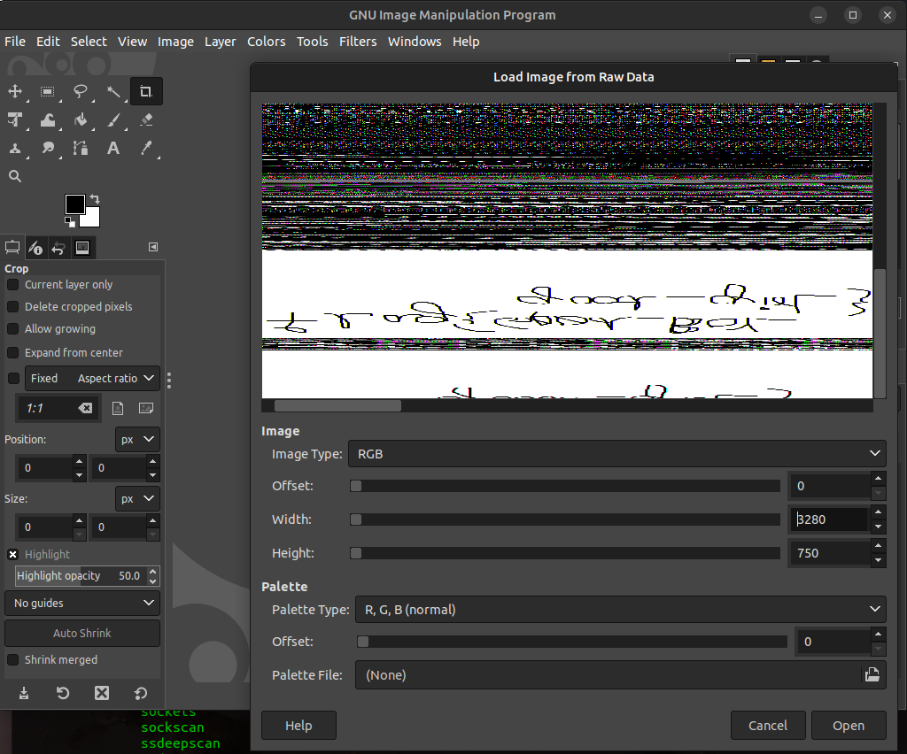
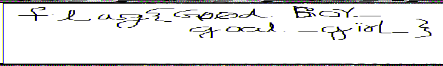
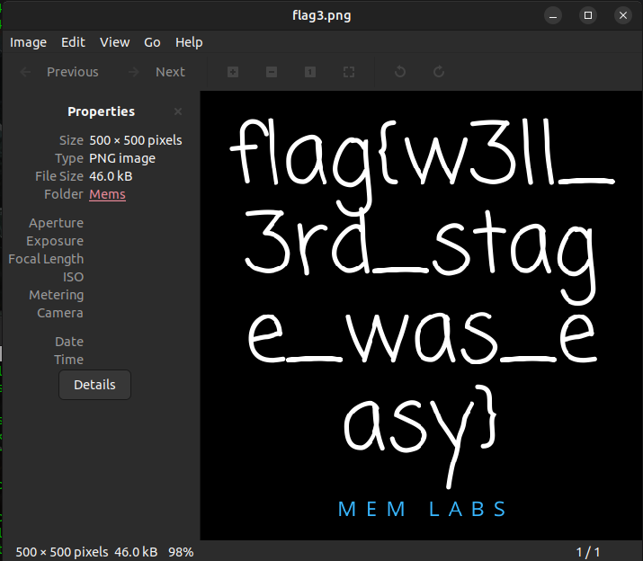
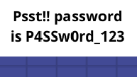
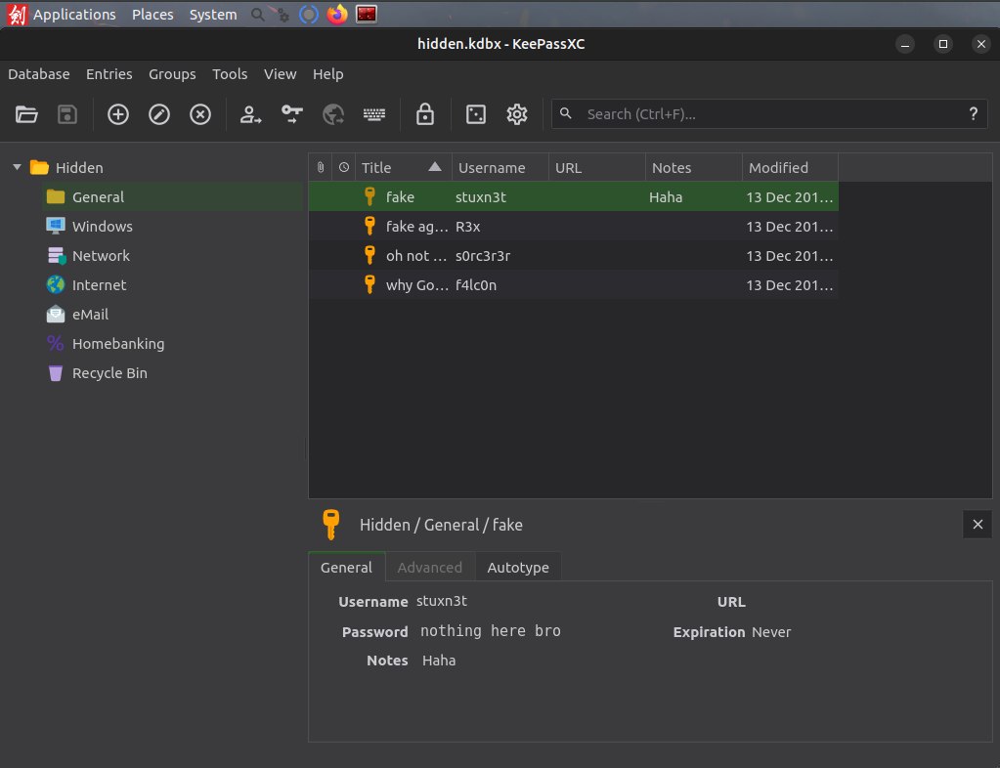
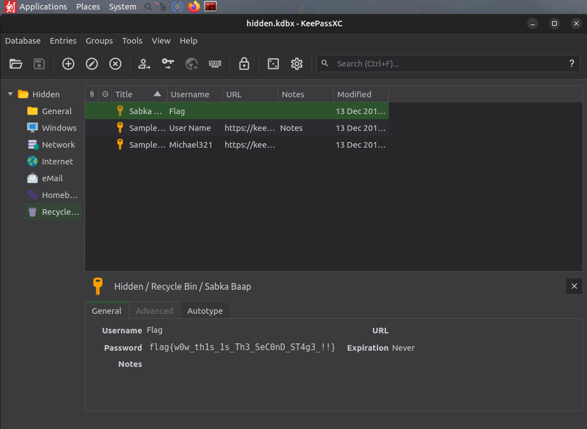
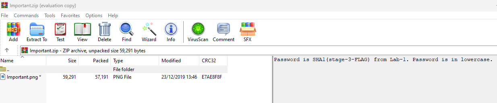

# MemLabs Solutions

This is solutions of famous memory forensics challenge [MemLabs](https://github.com/stuxnet999/MemLabs).

## MemLabs Lab 0

#### Use the following commands to acquire flag

```bash
volatility2 -f Challenge.raw imageinfo
volatility2 -f Challenge.raw --profile Win7SP1x86 pslist
volatility2 -f Challenge.raw --profile Win7SP1x86 cmdscan
volatility2 -f Challenge.raw --profile Win7SP1x86 consoles
volatility2 -f Challenge.raw --profile Win7SP1x86 envars
volatility2 -f Challenge.raw --profile Win7SP1x86 hashdump
```
Flag: flag{you_are_good_but1_4m_b3tt3r}

## MemLabs Lab 1

#### Use the following commands to acquire 1st flag

```bash
# Detect version of OS
volatility2 -f MemoryDump_Lab1.raw imageinfo
# List all running processes
volatility2 -f MemoryDump_Lab1.raw --profile Win7SP1x64 pslist
# List all executed CMDlets
volatility2 -f MemoryDump_Lab1.raw --profile Win7SP1x64 cmdscan
# List all stdout
volatility2 -f MemoryDump_Lab1.raw --profile Win7SP1x64 consoles
```
Flag encoded: ZmxhZ3t0aDFzXzFzX3RoM18xc3Rfc3Q0ZzMhIX0=

Flag: flag{th1s_1s_th3_1st_st4g3!!}

#### Use the following commands to acquire 2nd flag

```bash
# Find PID of mspaint
volatility2 -f MemoryDump_Lab1.raw --profile Win7SP1x64 pslist
# Dump run process to a file
volatility2 -f MemoryDump_Lab1.raw --profile Win7SP1x64 memdump -p 2424 -D paint/
# Change extension of file
mv 2424.raw 2424.data
# Open 2424.data file on GIMP
gimp 2424.data
```
###### Adjust width and height of image for reveal 2nd flag



#### Use the following commands to acquire 3rd flag

```bash
# List files that loaded to RAM. We only need Alissa's files
volatility2 -f MemoryDump_Lab1.raw --profile Win7SP1x64 filescan | grep "Alissa Simpson"
# Dump important.rar file
volatility2 -f MemoryDump_Lab1.raw --profile Win7SP1x64 dumpfiles -Q 0x000000003fac3bc0 -D important
# Find password of rar file by uppercase of hash of Alissa's password
volatility2 -f MemoryDump_Lab1.raw --profile Win7SP1x64 hashdump
# Unrar file
unar important.rar (Password required!)
```
###### flag3.png will be dropped


## MemLabs Lab 2

#### Use the following commands to acquire 1st flag

```bash
# Detect version of OS
volatility2 -f MemoryDump_Lab2.raw imageinfo
# List all process envars
volatility2 -f MemoryDump_Lab2.raw --profile Win7SP1x64 envars
```
Flag_encoded = ZmxhZ3t3M2xjMG0zX1QwXyRUNGczXyFfT2ZfTDRCXzJ9

Flag= flag{w3lc0m3_T0_$T4g3_!_Of_L4B_2})

#### Use the following commands to acquire 2nd flag

```bash
# Find location of hidden.kdbx and Password.png
volatility2 -f MemoryDump_Lab2.raw --profile Win7SP1x64 filescan
# Dump process to a file
volatility2 -f MemoryDump_Lab2.raw --profile Win7SP1x64 procdump -Q 0x000000003fb112a0 -D dumphidden/
# Dump Password.png to a file
volatility2 -f MemoryDump_Lab1.raw --profile Win7SP1x64 procdump -Q 0x000000003fce1c70 -D dumpPassword/
# Change extension of file
mv dumphidden/LONG_DUMP_FILE_NAME dumphidden/Hidden.kdbx
# Open Hidden.kdbx file on KeePassXC
sudo apt update
sudo apt install keepassxc
keepassxc
```
###### Extract Password from Password.png

###### Open kdbx file using password

###### Find flag location from saved passwords in DB


#### Use the following commands to acquire 3rd flag

```bash
# Dump Google Chrome history
volatility2 -f MemoryDump_Lab2.raw --profile Win7SP1x64 chromehistory
# There is a interesting link to mega.nz folder
https://mega.nz/folder/TrgSQQTS#H0ZrUzF0B-ZKNM3y9E76lg
```
###### Download and open file

###### Insert Password (Found it from hint in zip file that is SHA1 of flag3_Lab1(flag{w3ll_3rd_stage_was_easy}) = 6045dd90029719a039fd2d2ebcca718439dd100a)


## Contributing

Pull requests are welcome. For major changes, please open an issue first
to discuss what you would like to change.

Please make sure to update tests as appropriate.

## License

[MIT](https://choosealicense.com/licenses/mit/)
